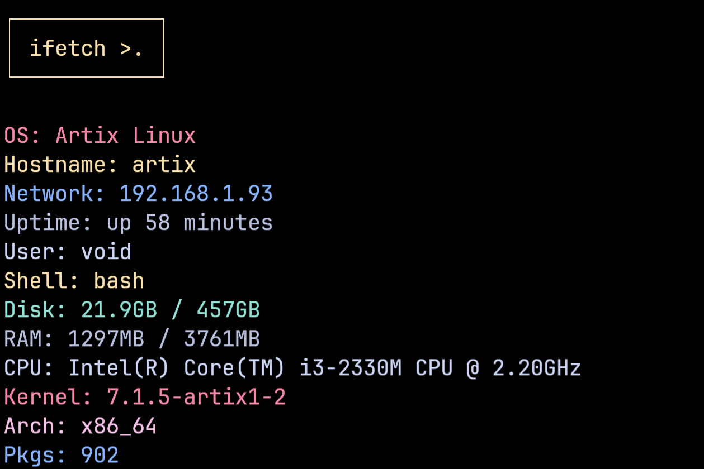

# Ifetch
Ifetch is a simple and lightweight tool that prints out system information.



[](https://opensource.org/licenses/MIT)


## Features
- Fast and minimal
- Written entirely in POSIX shell
- Lightweight with no unnecessary dependencies
- Simple configuration
- Easy to add your own modules

## Requirments
- A POSIX shell installed like Bash, Dash, Ash and more
- Sudo works (Needed for installation and updating)
- Tar, Sudo and wget are installed (Needed for installation and updating)

## Installation
Install Ifetch with a single command:
```curl -fsSL https://raw.githubusercontent.com/Ietsiee/ifetch/main/setup-ifetch.sh | sh```

## Updating
To update Ifetch with a single command:
```ifetch --update``` or ```ifetch -u```
Note: this will keep your files in **~/.config/ifetch** but replaces files in **/etc/ifetch** and **/bin/ifetch**
