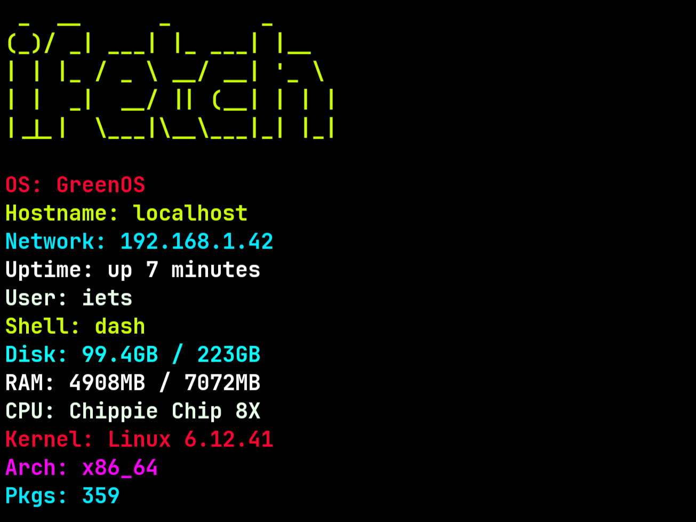

# ifetch
ifetch is a fast and lightweight tool for displaying system information, written entirely in POSIX shell.

<p align="center">
  
</p>

[](https://opensource.org/licenses/MIT)


## Features
- Fast and minimal
- Written entirely in POSIX shell
- Lightweight with no unnecessary dependencies
- Simple configuration
- Easy to create custom modules

## Usage
- ```ifetch``` Runs ifetch
- ```ifetch <config path>``` Runs ifetch with a custom configuration file
- ```ifetch -p / --presets``` Shows all installed presets
- ```ifetch -h / --help``` Shows the ifetch help page
- ```ifetch -v / --version``` Shows current version

## Requirements
- A POSIX-compatible shell such as Bash, Dash, or Ash
- Basic userland tools
- curl

## Installation
You can install ifetch using one of the following methods.

> [!WARNING]
> When installing or updating ifetch, your `/etc/ifetch/ifetch.config` will be replaced.
> To prevent losing your configuration, create your config at `~/.config/ifetch/ifetch.config`.

### Linux
**Requirements:** `sudo` and `git`
```
git clone https://github.com/Ietsiee/ifetch.git
cd ifetch
sudo sh build.sh install
```

### Termux Unstable
**Requirements:** `tar`, `sed` and `wget`
```
curl -fsSL https://raw.githubusercontent.com/Ietsiee/ifetch/main/installers/install-termux.sh | sh
```

### AUR
**Coming soon!**
**Requirements:** `yay` or `paru`
```
yay -S ifetch
paru -S ifetch
```

### Make
**Requirements:** `sudo`, `git` and `make`
```
git clone https://github.com/Ietsiee/ifetch.git
cd ifetch
sudo make install
```

## Custom Modules
See the [Custom Modules Guide](docs/custom-modules.md) for more information.

## Feedback
Found a bug or have an idea for ifetch? Open an issue and let me know!

## Clone ifetch 
```
git clone https://github.com/Ietsiee/ifetch.git
```

## APIs
- Binance - crypto prices
- wttr.in - weather